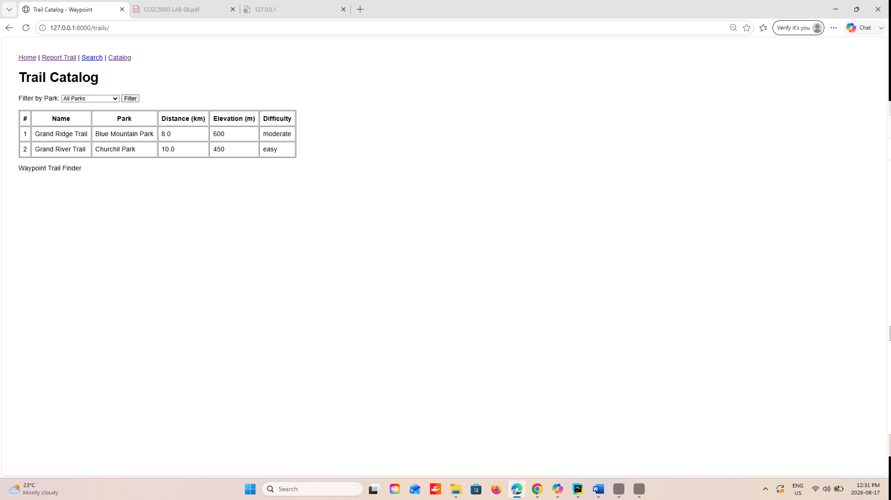
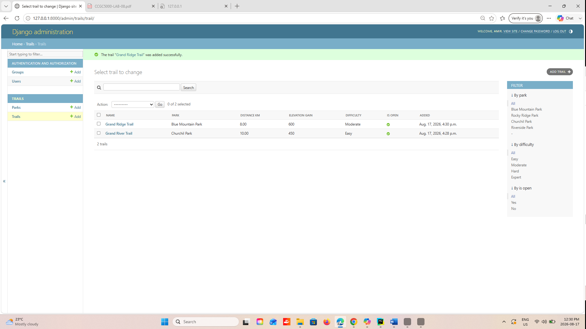

# Waypoint

Waypoint is a trail-finder and trip-planner built with Python and Django.

The project started as a plain Python object-oriented domain model and was later expanded into a Django web application with templates, forms, a database, an admin site, and relationships between trails and parks.

## Features

- Distance value type with validation and unit conversion
- Trail inheritance and polymorphism
- DayHike, BackpackingRoute, TrailRun, and GuidedDayHike
- Operator overloading for Distance
- Mixins and method resolution order
- Duck typing
- Django home page
- Trail report form with CSRF protection
- Trail search page
- Shared base template with navbar and footer
- Trail catalog
- Django ORM Trail model
- Django admin management
- Park model
- ForeignKey relationship between Trail and Park
- Filtering trails by park
- Automated tests

## Requirements

- Python 3.11 or later
- Django 4.2

## Setup

Clone the repository:

```bash
git clone https://github.com/Amir-8808284/waypoint.git
```

Move into the project folder:

```bash
cd waypoint
```

Create a virtual environment:

```bash
python -m venv env
```

Activate the virtual environment on Windows:

```bash
env\Scripts\activate
```

Install the required packages:

```bash
python -m pip install -r requirements.txt
```

Apply the database migrations:

```bash
python manage.py migrate
```

## Run the Application

Start the Django development server:

```bash
python manage.py runserver
```

Open the site in a browser:

```text
http://127.0.0.1:8000/
```

Open the Trail Catalog:

```text
http://127.0.0.1:8000/trails/
```

Open the Django Admin:

```text
http://127.0.0.1:8000/admin/
```

## Screenshots

### Trail Catalog



### Django Admin


